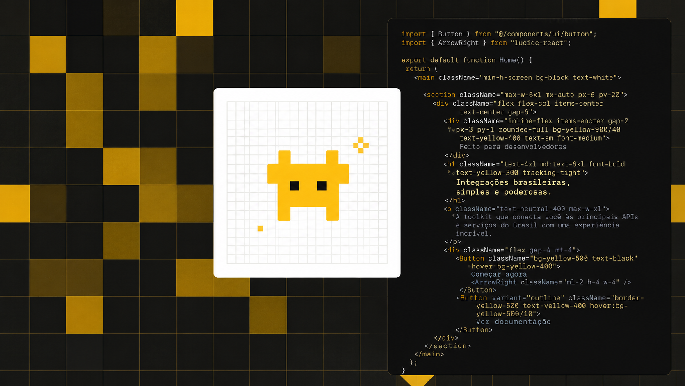

<p align="center">
  <picture>
    <source media="(prefers-color-scheme: dark)" srcset="apps/web/public/assets/kubo-wordmark-dark.svg" />
    
  </picture>
</p>

<p align="center">
  A modern CLI tool for scaffolding end-to-end type-safe TypeScript projects with best practices and customizable configurations.
</p>

<p align="center">
  <a href="https://www.npmjs.com/package/create-kubojs">
    
  </a>
  <a href="https://x.com/byalbuquerquesz">
    
  </a>
</p>

<br />

<p align="center">
  
</p>

<br />

## Quick Start

```bash
# Using bun (recommended)
bun create kubojs@latest

# Using pnpm
pnpm create kubojs@latest

# Using npm
npx create-kubojs@latest
```

## Features

- Frontend: React (TanStack Router, React Router, TanStack Start), Next.js, Nuxt, Svelte, Solid, Astro, React Native (Bare, NativeWind, Unistyles), or none
- Backend: Hono, Express, Fastify, Elysia, Self (fullstack web app), Convex, or none
- API: tRPC, oRPC, Orval, or none
- Runtime: Bun, Node.js, or Cloudflare Workers
- Databases: SQLite, PostgreSQL, MySQL, MongoDB (or none)
- ORMs: Drizzle, Prisma, Mongoose (or none)
- Auth: Better Auth or Clerk (optional)
- Addons: Turborepo, Vite+, PWA, Tauri, Electrobun, Biome, Lefthook, Husky, Oxlint, MCP, OpenTUI, Skills, S3-compatible Storage
- Testing: Vitest, Playwright
- Examples: Todo, AI
- DB Setup: Turso, Neon, Supabase, Prisma PostgreSQL, MongoDB Atlas, Cloudflare D1, Docker
- Web Deploy: Cloudflare Workers

Type safety end-to-end, clean monorepo layout, and zero lock-in: you choose only what you need.

## Credits

Kubo began as a continuation of [Better T Stack](https://github.com/AmanVarshney01/create-better-t-stack). We thank its maintainers and contributors for the foundation that made this project possible.

## Repository Structure

This repository is organized as a monorepo containing:

- **CLI**: [`apps/cli`](apps/cli) — published as [`create-kubojs`](https://www.npmjs.com/package/create-kubojs) (bins: `create-kubojs`, `kubojs`; `@kubojs/cli` compat alias)
- **Documentation / site**: [`apps/web`](apps/web) — Next.js marketing + docs
- **Video**: [`apps/video`](apps/video) — Remotion app (`@kubojs/video`) for brand/launch videos; Studio + render only (not nested under the web site)
- **Packages**: [`packages/types`](packages/types), [`packages/template-generator`](packages/template-generator), [`packages/backend`](packages/backend)

Agent usage guide: [`.agents/skills/kubojs/SKILL.md`](.agents/skills/kubojs/SKILL.md).

## Documentation

Run the local docs site with `bun dev` (port 3333). Source lives in [`apps/web/content/docs`](apps/web/content/docs). Use the Stack Builder at `/new` when the site is running.

## Development

```bash
# Clone the repository
git clone https://github.com/albuquerquesz/kubo.git
cd kubo

# Install dependencies
bun install

# Start website development
bun dev

# Start CLI development
bun cli

```

## Want to contribute?

Please read the Contribution Guide first and open an issue before starting new features to ensure alignment with project goals.

- Docs: [`./apps/web/content/docs/contributing.mdx`](./apps/web/content/docs/contributing.mdx)
- Repo guide: [`./.github/CONTRIBUTING.md`](./.github/CONTRIBUTING.md)
